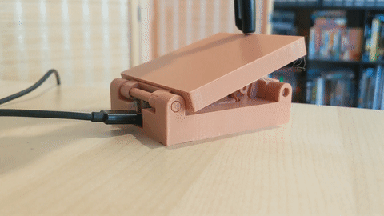
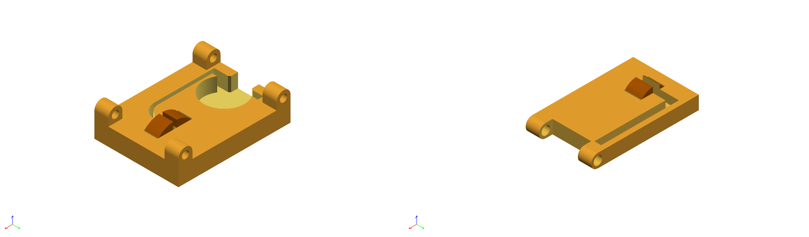
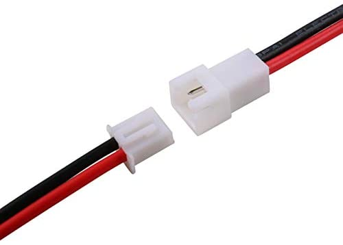
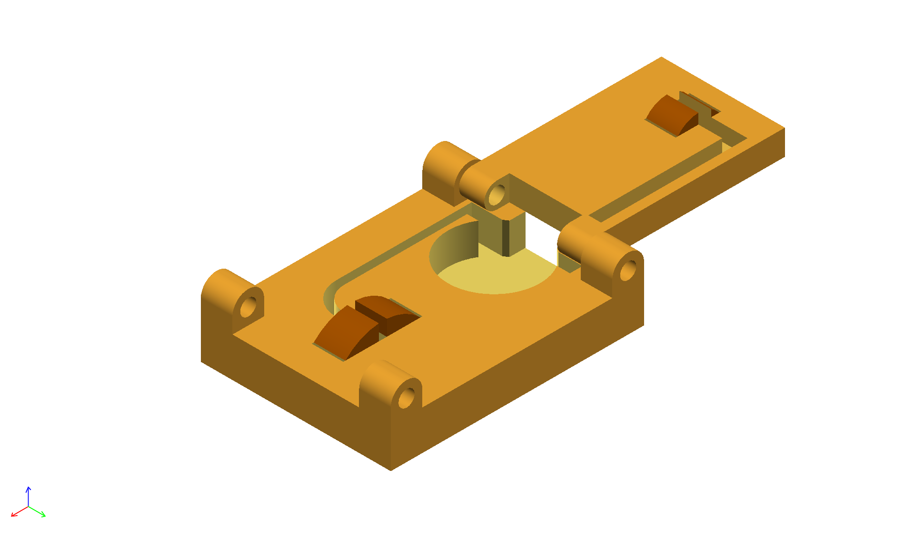
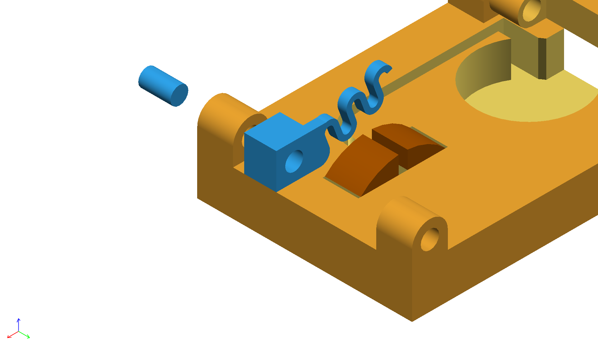

# Push-to-talk Pedal



A foot-operated pedal that toggles push-to-talk on the [Discord client](discord.gg).

My motivation wasn't very complex. I found myself unable to hold down a keyboard key (or mouse button) and a conveniently located push-to-talk button on my keyboard at once. Why not take advantage of an unused limb?

## Changelog

### [mk1]
- Rough prototype.

## Assembly

### Materials needed
- [Adafruit GEMMA M0](https://www.adafruit.com/product/3501)
- **Metal for the contacts**. I used [0.25mm brass sheets](https://www.amazon.com/gp/product/B0006MZM0K)
- [A prong and socket 2-pin JST connector](https://www.amazon.com/Upgraded-Connector-Battery-Inductrix-Eachine/dp/B07NWD5NTN)
- [Solder](https://www.amazon.com/Elenco-WEmake-Lead-Solder-0-031/dp/B009YKISMY)
- [Hot glue](https://www.amazon.com/ccbetter-Upgraded-Removable-Anti-hot-Flexible/dp/B01178RVI2)

You will also need these tools:

- [A 3d printer](https://shop.prusa3d.com/3d-printers/1387-original-prusa-mini-kit.html)
- [A soldering iron](https://www.amazon.com/Hakko-FX888D-23BY-Digital-Soldering-Station/dp/B00ANZRT4M)
- [A hot glue gun](https://www.amazon.com/ccbetter-Upgraded-Removable-Anti-hot-Flexible/dp/B01178RVI2)
- Scissors
- A permanent marker
- Alcohol wipes


### Print the parts

Print the [base](stl/Base.stl), [pedal](stl/Pedal.stl), [spring](stl/Spring.stl), [spring peg](stl/Peg%20for%20spring.stl) and [peg to connect the pedal](stl/Peg%20for%20pedal). The [cover](stl/Pedal%20cover.stl) is optional and can be printed while you assemble the contacts.

### Create the contacts

Locate the plastic humps on the base and pedal. They are colored brown in the diagram below. 



You will be fitting a piece of metal over each hump.

1. Create the **base contact** by cutting a metal strip approximately 30mm long and 8mm wide.
1. Fit the strip over the hump and into both small slots.
1. Trim any excess.
1. Mark the gap on the top of the strip.
1. Mark the underside in the same place; this is where you will solder.
1. Create the **pedal contact** by cutting a metal strip 25mm long and 8mm wide and repeating steps 1-5.

Set the contacts aside for now.

### Wiring

You will now connect JST connectors to the contacts and GEMMA. Here's what they should look like:



I'll call the left connector the **prong** and the right one the **socket**. Wires come out of both connectors. The prong will be connected to the pedal and base, forming one half of an electrical switch. The socket will be connected to the GEMMA, completing the switch.



1. Arrange your pedal and base as shown in the diagram above. You may need to use [the longer peg](stl/Peg%20for%20pedal) to keep them from moving.
1. Place the prong in the depression, colored in yellow in the diagram above.
1. Fit the **red** wire in the groove leading to the middle of the base hump.
1. Trim any excess wire.
1. Fit the **black** wire in the groove leading to the middle of the pedal hump.
1. Trim any excess wire.
1. Remove the prong and contacts.
1. Strip both ends of the wires.
1. Solder the **red** wire to the mark you made on the underside of the **base contact**.
1. Solder the remaining wire and contact.

Fit the contact on their humps and place the wires in their groves. Ensure everything fits snugly without popping out.

Now you'll solder the socket connector to the mircocontroller.

1. Place the GEMMA in the depression, aligning the USB port with the opening in the base.
1. Connect the prong to the socket.
1. Trim the socket's wires so that the black wire reaches `GND` an the red wire reaches `A0`. This was around 20mm for me.
1. Disconnect the prong from the socket.
1. Strip both ends of the socket's wires.
1. Solder the **red** wire to `A0` and the **black** wire to `GND`.

Connect the prong and socket and place the GEMMA back in the depression.

### Software upload

Before the final assembly, you'll want to test that everything works! 

1. Turn the GEMMA's dipswitch switch to "on".
1. Plug the GEMMA into a USB port. It should appear as a new removable drive.
1. Copy the contents of [`src`](src) to the root directory of the drive.

A dim green light should be visible when the pedal is not touching the base. Connect the two and the light should become more intense. 

### Final assembly

1. Warm up your hot glue gun.
1. Glue the microcontroller to the base. Only a dab is needed.
1. Glue the wires in their grooves.

Finally, attach the spring to the left side of the base using the [the shorter peg](stl/Peg%20for%20spring).



## Push-to-talk

To use a different push-to-talk key, change the value of `PUSH_TO_TALK_KEY` in `main.py`:

```python
PUSH_TO_TALK_KEY = Keycode.F10
```
